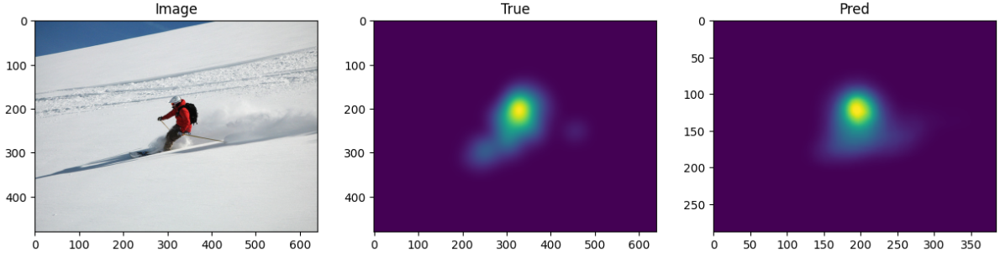
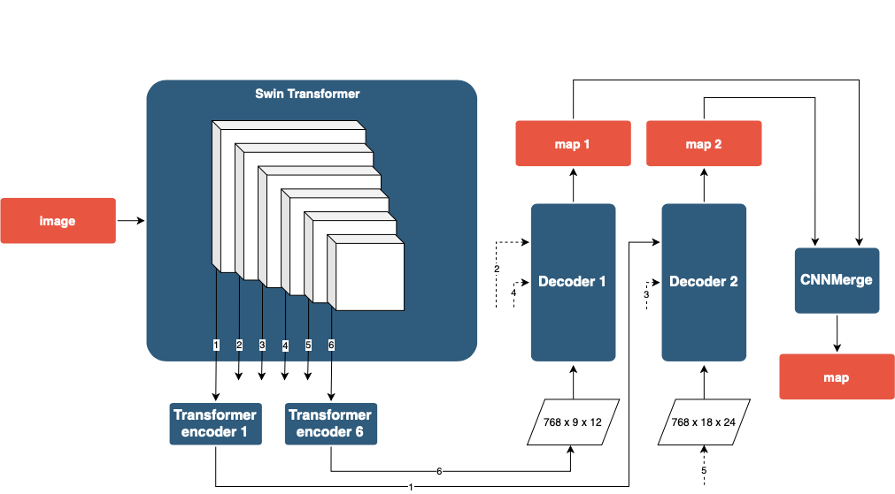

<h1>MDS-ViTNet: Improving saliency prediction for Eye-Tracking with Vision Transformer</h1>

In this [paper](https://arxiv.org/abs/2405.19501), we present a novel methodology we call MDS-ViTNet (Multi Decoder Saliency by Vision Transformer Network) for enhancing visual saliency prediction or eye-tracking. Our trained model MDS-ViTNet achieves SoTA results across several benchmarks.
  
## Results
Example of model work on an image from SALICON.

<table>
<tr>
   <td> 
      
   </td>
</tr>
</table>

## MDS-ViTNet architecture


## Dependencies and Installation

1. Clone Repo

   ```bash
   git clone https://github.com/IgnatPolezhaev/MDS-ViTNet.git
   ```

2. Create Conda Environment and Install Dependencies

   ```bash
   # create new anaconda env
   conda create -n mdsvitnet python=3.8 -y
   conda activate mdsvitnet

   # install python dependencies
   pip3 install -r requirements.txt
   ```

## Get Started
### Prepare pretrained models
Download our pretrained models from [Google Drive](https://drive.google.com/drive/folders/10tZL7oNfaRkBHHTeqjog0ZIJacrr2Ya0?usp=sharing) to the `weights` folder.

The directory structure will be arranged condaas:
```
weights
   |- CNNMerge.pth
   |- ViT_multidecoder.pth
```

### Quick test
We provide some examples in the [`inputs`](./inputs) folder. 
Run the following commands to try it out:
```shell
python inference.py --img_path inputs/img_1.jpg
```
The results will be saved in the `results` folder.

If you want to make a color predicted map added to the picture itself:
```shell
python inference.py --color True --img_path inputs/img_1.jpg
```

For the best result quality, feed images to the model with an aspect ratio of 3:4.

Inference takes up about 10 Gb of GPU

### Dataset preparation
Download train/val/test data from [Google Drive](link). Unzip downloaded datasets files to `datasets`.

The `datasets` directory structure will be arranged as:
```
datasets
   |- train
      |- train_images
         |- 00000.jpg
         |- 00001.jpg
      |- train_maps
         |- 00000.png
         |- 00001.png   
   |- val
      |- val_images
         |- 00000.jpg
         |- 00001.jpg
      |- val_maps
         |- 00000.png
         |- 00001.png 
   |- test
      |- test_images_salicon
         |- 00000.png
         |- 00001.png 
```

### Training
You can use our notebooks `train_multidecoder_model.ipynb` and `train_add_model.ipynb` to train a custom model.

## Contact
If you have any questions, please feel free to reach me out at `polezhaev.im@phystech.edu`. 

## Acknowledgement
This code is based on [TranSalNet](https://github.com/LJOVO/TranSalNet).
